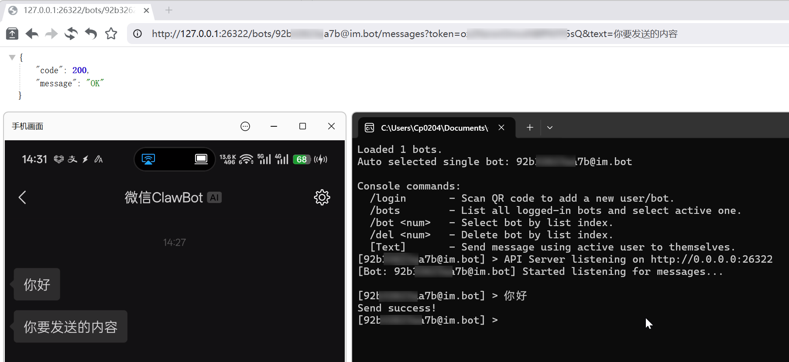

# WeClawBot-API

基于 `微信ClawBot` (iLink) 实现的个人微信消息推送 API 服务。

**它体积极小(≈10MB)，内存占用极低(≈10MB)，极易部署(Docker/二进制)，极易调用(HTTP API)。**

无额外依赖，独立运行，方便供其他程序请求，发送微信通知。



> [!TIP]
> 没错！个人微信消息推送它来了！~~再也不用~~折腾企业微信/第三方服务号了！
>
> **当前灰度中，可用性待观察*

## 功能特性

- **多账号支持**：支持同时登录多个微信号，每个账号独立推送、互不干扰
- **扫码登录**：控制台直接打印二维码，微信扫码即可完成授权
- **持久化存储**：登录凭证（Token、游标等）自动保存，重启后自动重连
- **命令行交互**：内置简易控制台，可直接在终端中收发微信消息
- **HTTP API**：提供标准 RESTful 接口，支持通过 API 发送文本消息及设置“正在输入”状态

## 部署

### Docker Compose (推荐)

创建 `docker-compose.yml` 文件：

```yaml
name: weclawbot-api
services:
  weclawbot-api:
    image: cp0204/weclawbot-api:latest
    container_name: weclawbot-api
    ports:
      - "26322:26322"
    volumes:
      - ./config:/app/config
    restart: unless-stopped
```

### Docker Run

```bash
docker run -d \
  --name weclawbot-api \
  -p 26322:26322 \
  -v ./config:/app/config \
  --restart unless-stopped \
  cp0204/weclawbot-api:latest
```

### 初次扫码登录

容器启动后，进入容器终端(sh)，输入 `bot` 扫码登录，授权后的信息将保存在挂载的 `config` 目录下。

NAS 部署可通过 WebUI 进入容器终端，也可以在宿主机上通过以下命令进入：

```bash
# 宿主机进入容器终端
docker exec -it weclawbot-api bot
```

> [!TIP]
> 授权成功后，在微信发一条消息给`微信ClawBot`，否则无法激活 API 发信。

> [!WARNING]
> 请妥善保管 `config/auth.json` 文件及 `api_token`，不要泄露。

## 环境变量

 - `WECLAWBOT_CALLBACK_URL`：若设置，所有收到的文本消息会以 JSON POST 到该地址，便于 webhook 异步处理（参考下方「回调」示例）。
 - `WECLAWBOT_INTERNAL_TOKEN`：设置后，该值会作为全局 Bearer Token 被接受，方便集群或内部服务在不读取单个 bot api_token 的情况下调用 API（Header 或 `token=` 参数均可）。同时，回调也会把这个 Token 附加在 `Authorization: Bearer <value>` 头里，方便 webhook 验证来源。

设置 `WECLAWBOT_CALLBACK_URL` 后，服务会在 `callback` 被触发时 POST 一个包含 `botId`、`fromUserId`、`text`、`contextToken`、`messageId`、`receivedAt` 及原始 payload 的 JSON 结构，并在 `WECLAWBOT_INTERNAL_TOKEN` 设置时附加 `Authorization: Bearer <token>` 头以便 webhook 端验证。

### 回调示例
```json
{
  "botId": "bot-alpha",
  "fromUserId": "wx-user-123",
  "text": "你好，欢迎回来！",
  "contextToken": "ctx-abc-123",
  "messageId": "bot-alpha-1a2b3c4d",
  "receivedAt": "2026-03-31T00:00:00Z",
  "rawPayload": {
    "from_user_id": "wx-user-123",
    "context_token": "ctx-abc-123",
    "item_list": [
      {
        "type": 1,
        "text_item": {"text": "你好，欢迎回来！"}
      }
    ]
  }
}
```

## 常用命令

- `/login` : 发起新的扫码登录流程
- `/bots`  : 列出当前所有已登录 `bot_id` 及其 `api_token`
- `/bot <序号>` : 切换当前活跃发送身份
- `/del <序号>` : 删除指定索引的 Bot 账号配置

## API 文档

> [!TIP]
> 新手省流版，发消息直接替换参数访问：
> ```
> http://192.168.8.8:26322/bots/{bot_id}/messages?token={api_token}&text=Hello
> ```

API 支持 `GET` 和 `POST` 请求，兼容以下多种提交方式：

- GET
- POST
  - `application/json`
  - `application/x-www-form-urlencoded`
  - `multipart/form-data`

### 身份验证

所有接口均需验证 `api_token`（可通过 `/bots` 命令或查看 `config/auth.json` 获取）

你可以通过以下任一方式传递 Token：

- **Header**: `Authorization: Bearer <api_token>`
- **Body/Query**: `token=<api_token>`

如需集群或平台统一调用，可在系统级别设置 `WECLAWBOT_INTERNAL_TOKEN`，携带该值的请求会同样被视为合法 Token。


### 发送消息

**Endpoint:** `/bots/{bot_id}/messages`

**参数:**
- `text`: 消息文本内容。
- `toUserId`: 可选，指定目标用户/群，默认自动使用最近一条消息发送者。
- `contextToken`: 可选，带上上下文令牌可确保会话上下文（同样会默认使用最近一次接收到的 `context_token`）。

你可以在一次请求中同时提交 `text`、`toUserId`（或默认使用最近的发信人）以及 `contextToken`。如果需要保持对话上下文，就把 callback 里收到的 `contextToken` 原样带回去。

**示例:**
```bash
# GET
curl http://192.168.8.8:26322/bots/{xxx@im.bot}/messages?token={api_token}&text=Hello
```
```bash
# POST
curl -X POST http://192.168.8.8:26322/bots/{xxx@im.bot}/messages \
  -H "Content-Type: application/json" \
  -H "Authorization: Bearer {api_token}" \
  -d '{
    "text": "Hello, this is a POST request!"
  }'
```

### 发送输入状态

**Endpoint:** `/bots/{bot_id}/typing`

**参数:**
- `status`: `1`=正在输入，`2`=停止输入

**示例:**
```bash
# GET
curl http://192.168.8.8:26322/bots/{xxx@im.bot}/typing?token={api_token}&status=1
```
```bash
# POST
curl -X POST http://192.168.8.8:26322/bots/{xxx@im.bot}/typing \
  -H "Content-Type: application/json" \
  -H "Authorization: Bearer {api_token}" \
  -d '{
    "status": 1
  }'
```

### 响应格式

所有 API 均返回标准 JSON 结构：

**成功响应 (200 OK):**
```json
{
  "code": 200,
  "message": "OK"
}
```

**错误响应 (4xx/5xx):**
```json
{
  "code": 401,
  "error": "Unauthorized"
}
```

## 致谢

- 微信官方插件 [@tencent-weixin/openclaw-weixin](https://www.npmjs.com/package/@tencent-weixin/openclaw-weixin)
